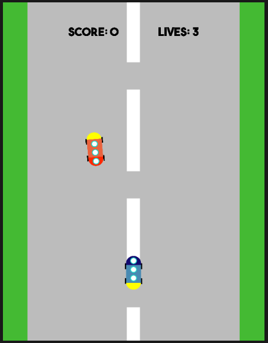

# WWDC2021 Submission [Accepted]

My WWDC 2021 Submission! 🚀

P.S. If you're looking for WWDC tips, I actually made a video of my experience applying for the WWDC 2021 competition! You can find it [here](https://youtu.be/T32k8JW4J0g)

I made a car game that has enemies that randomly shoot you from the other side, and you have to shoot them down before they hit you! In addition, every time a car goes past you without hitting you, you lose a life. If you lose all 3, game over!

## Running the App 🖥

Ensure that you have either **Xcode** or **Swift Playgrounds** installed (Sorry Windows users!). I built this playground in Xcode Playgrounds so personally I would use that but you can also run it in Swift Playgrounds (though it is quite slower).

To run the playground just click on the **MyPlayground.playground** file and it should open in the app of your choosing.